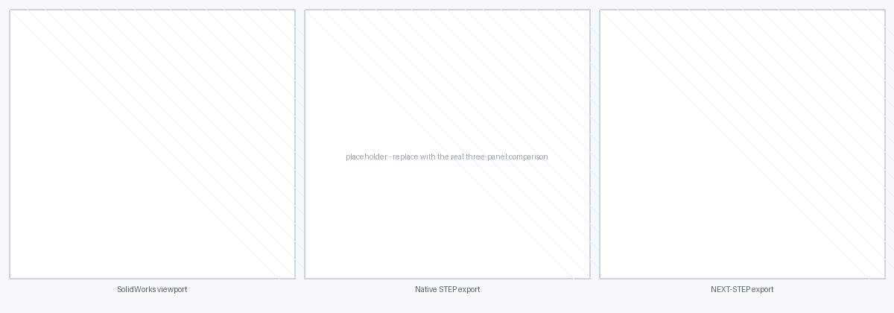

<h1 align="center">
  <br>
  NEXT-STEP
</h1>

<p align="center">
  <strong>STEP export for SolidWorks that keeps your appearances.</strong><br>
  <a href="../../releases/latest">Download</a> ·
  <a href="#install">Install</a> ·
  <a href="#what-it-fixes">What it fixes</a>
</p>

---

SolidWorks flattens component and assembly level appearance overrides when it
writes STEP. Two instances of the same part, overridden to different colours,
come out the same colour. A top level override that paints a whole assembly
disappears. NEXT-STEP puts these colours back.

<!-- Three-panel comparison: SolidWorks viewport / native STEP export / NEXT-STEP export -->


<p align="center"><sub>STEP files imported into Blender with
<a href="https://github.com/Peak-Design/STEPper_NEXT">STEPper NEXT</a>.</sub></p>

## What it fixes

**Appearance overrides.** An override on a component or an assembly survives the
export. SolidWorks drops them and writes the colour of the part instead.

**Re-used parts.** Each instance of a part keeps its own colour. In a SolidWorks
export they all share one colour, so every instance after the first is wrong.

**Engineering material.** The material name and density go into the file.
SolidWorks writes neither.

**Geometry is untouched.** NEXT-STEP changes only colour and material. The
geometry in the file is the SolidWorks geometry, byte for byte. Nothing is
re-toleranced or healed, and no PMI is lost.

## Install

1. Download the latest release archive and extract it.
2. Close SolidWorks.
3. Run **Install.bat**, and accept the prompt for administrator rights.
4. Start SolidWorks.
5. If **NEXT-STEP** is not already ticked, tick it in *Tools → Add-Ins*.

**Export STEP+** is on the NEXT-STEP tab for parts and assemblies.

To remove the add-in, run **Uninstall.bat**.

Windows SmartScreen can warn about the download, because the archive is not
signed. Select *More info → Run anyway*.

### Supported versions

SolidWorks 2022 to 2026, 64-bit. NEXT-STEP needs .NET Framework 4.8. Windows
10 and Windows 11 include it.

## The export options

**De-instance (default on).** Instances that need different colours become
separate parts, so every reader shows the right colour. Instances that share a
colour stay instances, and cost no extra geometry.

Turn de-instancing off to keep every instance shared. The file is smaller, but
only readers that support per-instance colour show the right colours. Most do
not, including Fusion 360.

**Include hidden components (default off).** Suppressed components are never
exported.

**Engineering material (default off).** Writes the material name and density.

With de-instancing on, the names are numbered per colour: `Plain Carbon Steel`,
`Plain Carbon Steel.001`, and so on. Readers that group by material name then
keep the colours apart. Any tool that reads the material reports the numbered
name, so turn de-instancing off to keep the exact material names.

## Known limits

- STEP cannot carry textures, UV mapping, roughness or metallic values. No
  entity for them exists in AP214 or AP242. A companion glTF file is the planned
  answer.
- AP242 export through `PublishSTEP242File` needs a SolidWorks MBD licence, so
  NEXT-STEP does not use it. Everything here works in AP214, which needs no
  extra licence.

## Build from source

You need SolidWorks, for the interop assemblies, and the .NET SDK.

```
dotnet build src\Peak.NextStep\Peak.NextStep.csproj -c Release
src\Peak.NextStep\Register-Addin.bat
```

## Support

[Peak Design](https://github.com/Peak-Design) — current maintainer. Tips
welcome: [ko-fi.com/oskarasspalvys](https://ko-fi.com/oskarasspalvys).

## Licence

MIT. See [LICENSE](LICENSE). The MIT licence does not cover the SolidWorks
interop assemblies, which are the property of Dassault Systèmes. See
[THIRD-PARTY-NOTICES.md](THIRD-PARTY-NOTICES.md).
